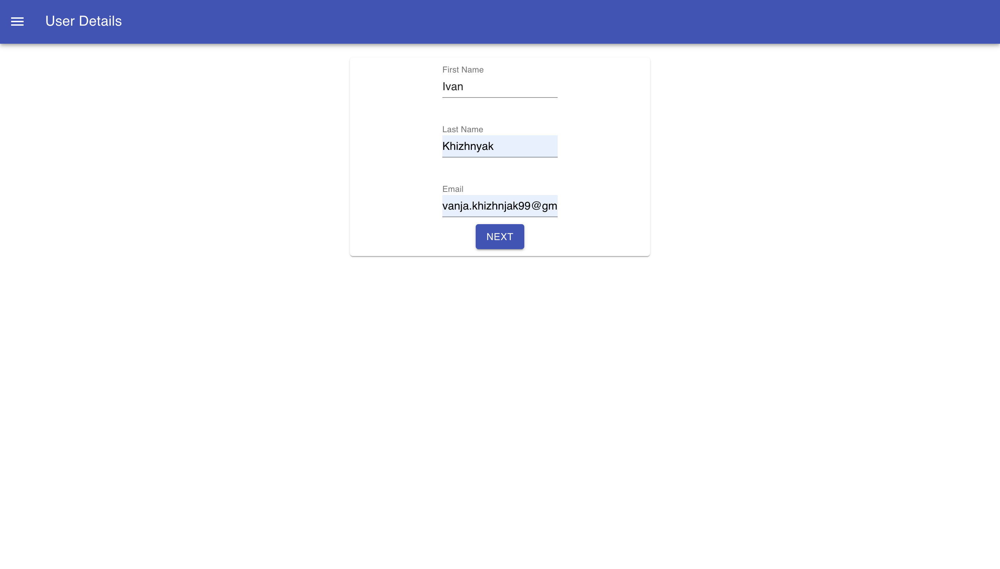
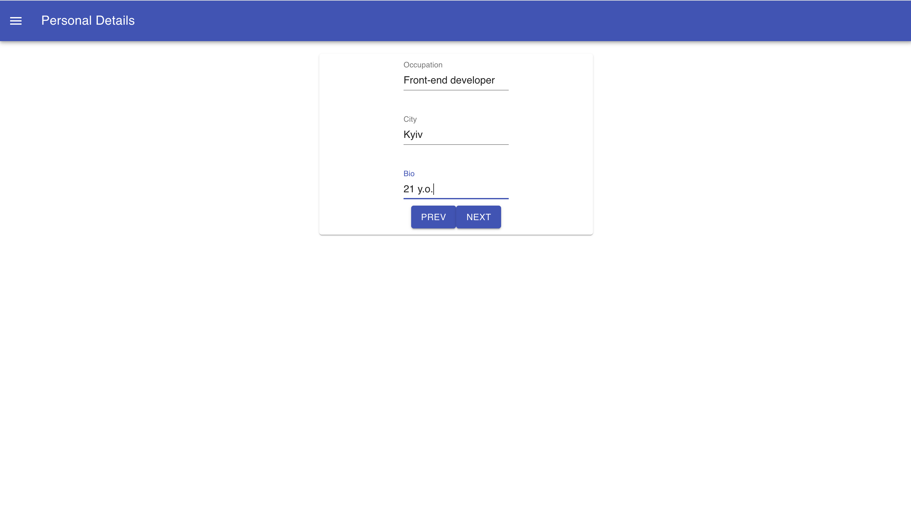
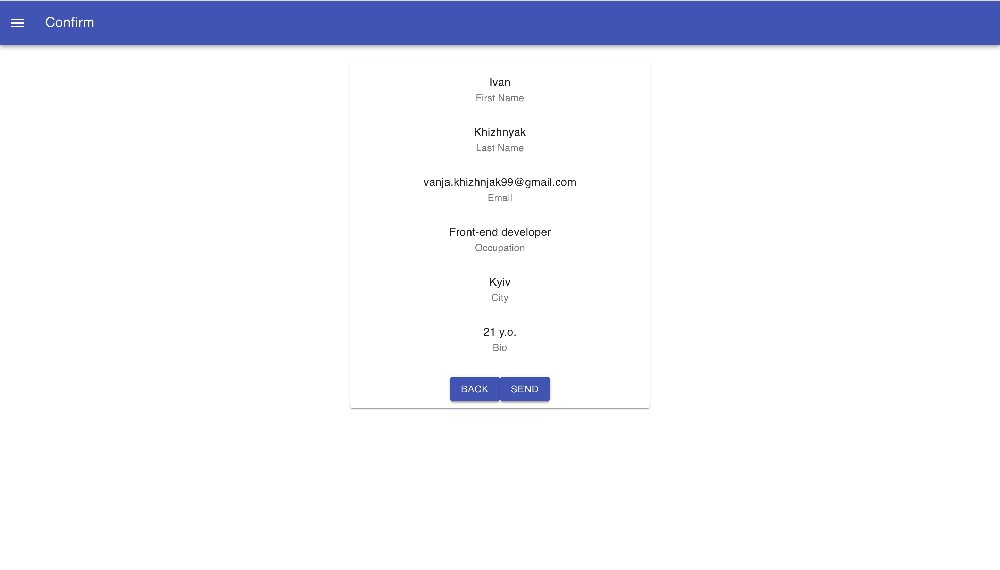
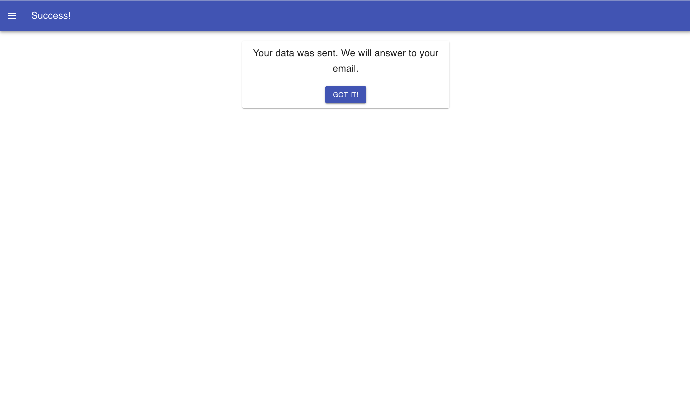
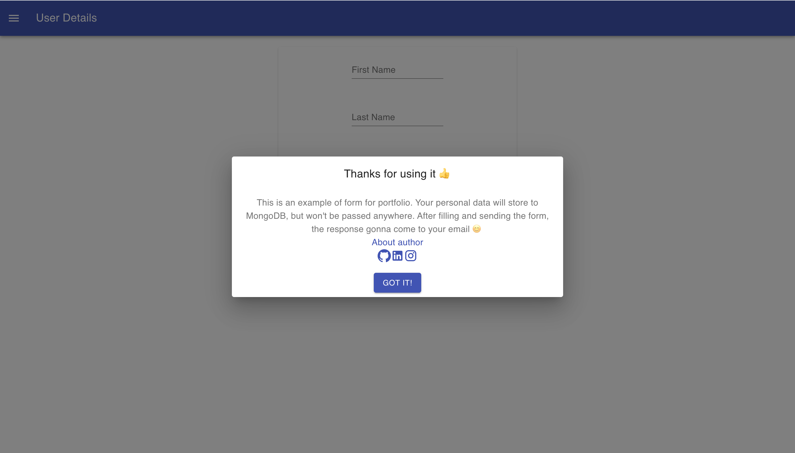

Attention: This project is still in a row, because of this some functionality may work improperly

<h1> Easy Form </h1>

This project is example of form form for registration or getting some data from the user.

In this project I used the next tools:

<ul>
  <li>Material UL</li>
  <li>Formik</li>
  <li>SCSS</li>
  <li>React</li>
  <li>TypeScript</li>
  <li>Yup</li>
</ul>

<h3>Photos of the project</h3>

